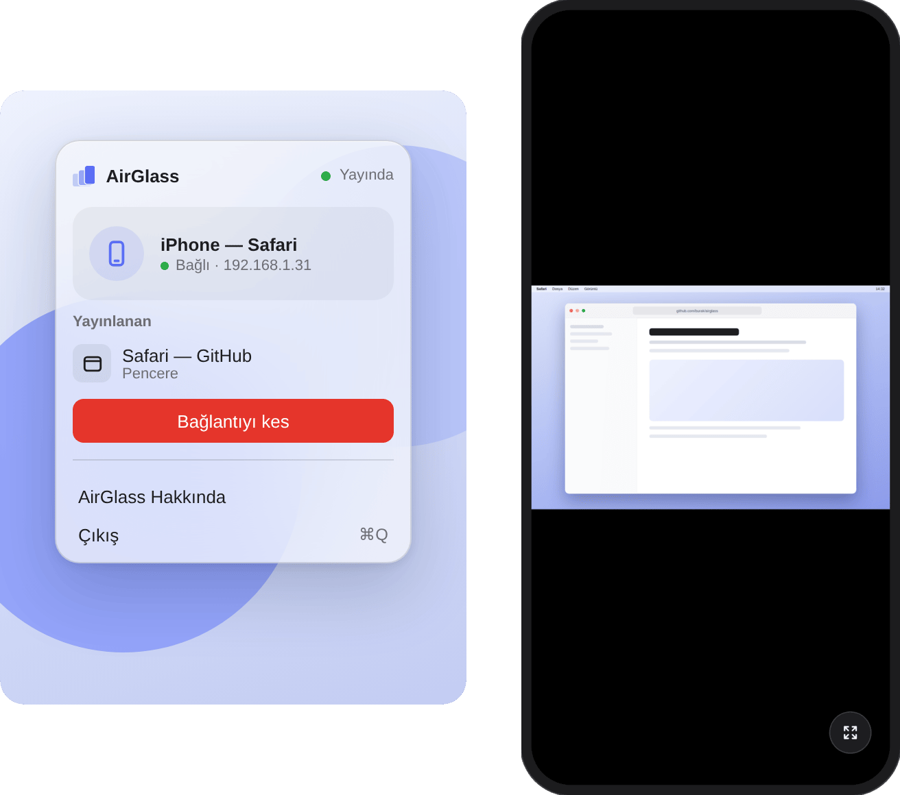
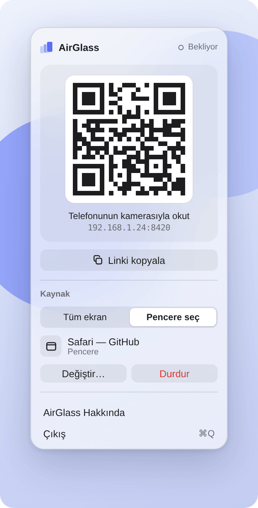
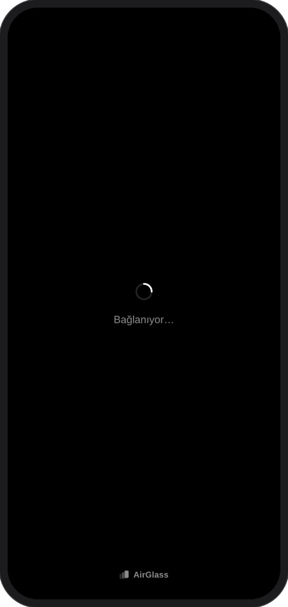
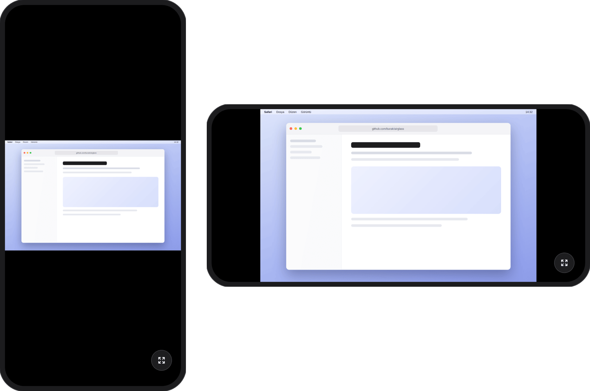
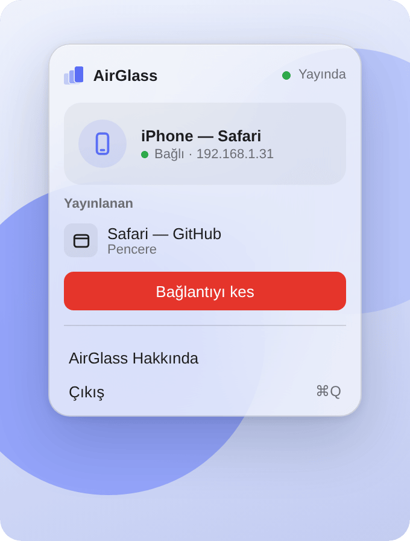
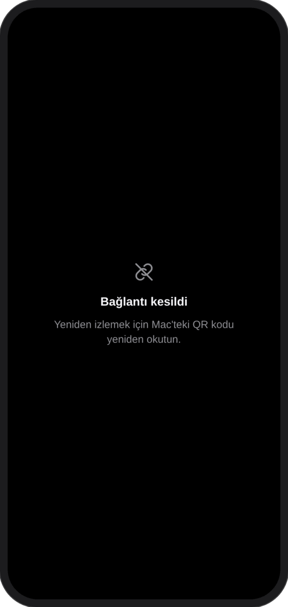

<p align="center">
  <picture>
    <source media="(prefers-color-scheme: dark)" srcset="Branding/wordmark-dark.svg">
    
  </picture>
</p>

<p align="center">
  <picture>
    <source media="(prefers-color-scheme: dark)" srcset="docs/screenshots/hero-dark.png">
    
  </picture>
</p>

<p align="center">
  <b>Türkçe</b> · <a href="#english">English</a>
</p>

---

## Türkçe

AirGlass, Mac'inin ekranını ya da tek bir pencereyi aynı Wi-Fi'deki bir telefonun tarayıcısına canlı yansıtan, açık kaynak ve minimal bir macOS menü çubuğu uygulamasıdır. Telefona hiçbir şey kurmazsın: QR kodu okutursun, görüntü Safari'de açılır.

### Özellikler

- **Tamamen yerel.** Görüntü Mac'ten telefona doğrudan, yerel ağ üzerinden gider. Uygulama internete hiçbir istek atmaz: analitik yok, güncelleme kontrolü yok, STUN/TURN sunucusu yok.
- **Şifreli görüntü.** Yayın WebRTC (DTLS-SRTP) ile şifrelenir. Video codec'i H.264'tür; iPhone'da donanımla çözülür.
- **Uygulama kurmadan izleme.** Telefonda yalnızca Safari (ya da başka bir tarayıcı) yeterli.
- **Tek kullanımlık QR.** QR kodun içindeki anahtar ilk bağlantıda geçersiz olur. Bağlantı kopunca ya da "Bağlantıyı kes"e basınca yeni bir QR üretilir.
- **Tek izleyici.** Biri izlerken başka bir cihaz bağlanamaz.
- **Sadece görüntü.** Telefondan Mac'e dokunma, fare ya da klavye girdisi gitmez.
- **Tüm ekran veya tek pencere.** Seçim macOS'un kendi içerik seçicisiyle yapılır.
- **Her an görünür.** Biri izlerken menü çubuğundaki ikon değişir.

### Kurulum

1. [Releases](https://github.com/lupusoftco/airglass/releases/latest) sayfasından `AirGlass-<sürüm>.dmg` dosyasını indir.
2. `.dmg`'yi aç ve **AirGlass**'ı **Applications** klasörüne sürükle.
3. AirGlass'ı aç. Uygulama Apple tarafından onaylanmadığı (notarize edilmediği) için macOS ilk açılışta engeller. Şöyle açabilirsin:
   1. Uyarıda **Bitti**'ye bas.
   2. **Sistem Ayarları → Gizlilik ve Güvenlik**'i aç.
   3. Aşağı kaydır. **Güvenlik** bölümünde AirGlass'ın engellendiğini söyleyen satırın yanındaki **Yine de Aç**'a bas.
   4. Parolanı gir ve çıkan pencerede yine **Yine de Aç**'ı seç.

   Bunu yalnızca bir kez yaparsın.

   **Alternatif:** Terminal'de uygulamanın karantina işaretini kaldırırsan macOS onu engellemez:

   ```sh
   xattr -dr com.apple.quarantine /Applications/AirGlass.app
   ```
4. Menü çubuğunda AirGlass ikonu belirir; Dock'ta ikon yoktur.
5. İlk kez bir kaynak seçtiğinde macOS **Ekran Kaydı** izni ister. **Sistem Ayarları → Gizlilik ve Güvenlik → Ekran ve Sistem Sesi Kaydı** bölümünden AirGlass'a izin ver, sonra AirGlass'ı kapatıp yeniden aç.
6. macOS **yerel ağ** erişimi ve güvenlik duvarı açıksa **gelen bağlantılar** için izin isteyebilir. İkisine de izin ver; telefon Mac'e bunlar sayesinde ulaşır.

### Nasıl çalışır

**1. Kaynağı seç ve QR kodu okut.** Menü çubuğundaki AirGlass ikonuna tıkla. **Tüm ekran** ya da **Pencere seç** ile neyin yansıtılacağını seç, sonra QR kodu telefonunun kamerasıyla okutup açılan bağlantıya dokun.

<p align="center">
  <picture>
    <source media="(prefers-color-scheme: dark)" srcset="docs/screenshots/popover-waiting-dark.png">
    
  </picture>
</p>

**2. Telefon bağlanır.** Safari açılır ve Mac'e bağlanır; telefona hiçbir şey kurulmaz.

<p align="center">
  
</p>

**3. Ekranın telefonda.** Görüntü yerel ağ üzerinden, şifreli olarak gelir. Görüntüye dokununca tam ekrana geçer; telefonu yan da çevirebilirsin.

<p align="center">
  
</p>

**4. Bitirmek için Bağlantıyı kes.** Biri izlerken popover bağlı cihazı gösterir ve menü çubuğu ikonu değişir.

<p align="center">
  <picture>
    <source media="(prefers-color-scheme: dark)" srcset="docs/screenshots/popover-connected-dark.png">
    
  </picture>
</p>

**5. Yeni QR.** Telefon "Bağlantı kesildi" der. QR kod tek kullanımlık olduğu için Mac'te hemen yeni bir QR kod belirir.

<p align="center">
  
</p>

<sub>Görseller AirGlass'ın arayüz tasarımından üretilmiştir.</sub>

### Kaynaktan derleme

Gerekenler: macOS 14 (Sonoma) veya üstü, Xcode 16 veya üstü, [Homebrew](https://brew.sh).

```sh
brew install xcodegen
git clone https://github.com/lupusoftco/airglass.git
cd airglass
cp Config/Local.xcconfig.example Config/Local.xcconfig
```

`Config/Local.xcconfig` dosyasında `DEVELOPMENT_TEAM` satırına kendi Team ID'ni yaz. Ücretsiz "Personal Team" yeterli; Team ID'yi **Xcode → Settings → Accounts** bölümünde bulursun. Bu dosya git'e girmez. Team ID vermezsen uygulama ad-hoc imzalanır; çalışır ama macOS her derlemede Ekran Kaydı iznini yeniden ister.

```sh
make run    # projeyi üretir, derler ve AirGlass'ı başlatır
make dmg    # dist/AirGlass-<sürüm>.dmg üretir
make clean  # derleme çıktılarını siler
```

Xcode'da çalışmak istersen `make project` ile `AirGlass.xcodeproj` dosyasını üretip açabilirsin.

### Bilinen sınırlamalar

- **Mac ve telefon aynı Wi-Fi'de olmalı.** Bağlantı yalnızca yerel ağda kurulur.
- **Misafir ya da istemci izolasyonlu ağlarda çalışmaz.** Otel, kafe, kurumsal misafir ağları gibi cihazların birbirini görmesine izin vermeyen ağlarda telefon Mac'e ulaşamaz.
- **Ekranı açık tutma yöntemi çalan müziği durdurabilir.** Safari, http üzerinden açılan sayfalarda ekranı açık tutma API'sini (Wake Lock) sunmaz. AirGlass bunun yerine ilk dokunuşta görünmez, sessiz bir video oynatır. Bu da telefonda çalan müziği ya da podcast'i durdurabilir. Tam ekrandayken buna gerek kalmaz.
- **Ses aktarılmaz;** yalnızca görüntü.
- **Aynı anda tek izleyici.**
- **Sayfa ve sinyalleşme yerel ağda şifresiz HTTP üzerinden gider;** görüntünün kendisi şifrelidir. Tek kullanımlık anahtar URL'nin `#` kısmında taşınır, sunucu loglarına ve HTTP isteklerine girmez.
- **Uygulama notarize edilmemiştir;** ilk açılışta "Yine de Aç" adımı gerekir.

### Lisans

[MIT](LICENSE)

---

<a id="english"></a>

## English

AirGlass is a small, open-source macOS menu bar app that mirrors your Mac's screen, or a single window, live to the browser of a phone on the same Wi-Fi. Nothing gets installed on the phone: scan the QR code and the picture opens in Safari.

### Features

- **Entirely local.** Video goes straight from the Mac to the phone over your local network. The app makes no requests to the internet: no analytics, no update checks, no STUN/TURN servers.
- **Encrypted video.** The stream uses WebRTC (DTLS-SRTP). The video codec is H.264, which the iPhone decodes in hardware.
- **Watch without an app.** Safari (or any modern browser) on the phone is all you need.
- **One-time QR code.** The key inside the QR code stops working after the first connection. A new QR code appears when the viewer disconnects or you press "Bağlantıyı kes" (Disconnect).
- **One viewer at a time.** While someone is watching, no other device can connect.
- **View only.** No touch, mouse or keyboard input goes from the phone to the Mac.
- **Whole screen or a single window,** chosen with macOS's own content picker.
- **Always visible.** The menu bar icon changes while someone is watching.

### Installation

1. Download `AirGlass-<version>.dmg` from the [Releases](https://github.com/lupusoftco/airglass/releases/latest) page.
2. Open the `.dmg` and drag **AirGlass** into **Applications**.
3. Open AirGlass. The app is not notarized by Apple, so macOS blocks the first launch. To open it:
   1. Click **Done** in the warning.
   2. Open **System Settings → Privacy & Security**.
   3. Scroll down to **Security** and click **Open Anyway** next to the line saying AirGlass was blocked.
   4. Enter your password and choose **Open Anyway** again.

   You only need to do this once.

   **Alternatively,** remove the quarantine flag in Terminal and macOS won't block the app:

   ```sh
   xattr -dr com.apple.quarantine /Applications/AirGlass.app
   ```
4. The AirGlass icon appears in the menu bar; there is no Dock icon.
5. The first time you pick a source, macOS asks for **Screen Recording** permission. Allow AirGlass under **System Settings → Privacy & Security → Screen & System Audio Recording**, then quit and reopen AirGlass.
6. macOS may also ask for **local network** access and, if the firewall is on, for **incoming connections**. Allow both; they are how the phone reaches the Mac.

### How it works

**1. Pick a source and scan the QR code.** Click the AirGlass icon in the menu bar. Choose **Tüm ekran** (whole screen) or **Pencere seç** (pick a window), then scan the QR code with your phone's camera and tap the link.

<p align="center">
  <picture>
    <source media="(prefers-color-scheme: dark)" srcset="docs/screenshots/popover-waiting-dark.png">
    
  </picture>
</p>

**2. The phone connects.** Safari opens and connects to the Mac; nothing is installed on the phone.

<p align="center">
  
</p>

**3. Your screen, on the phone.** The picture arrives encrypted over your local network. Tap it to go fullscreen; rotating the phone works too.

<p align="center">
  
</p>

**4. Press Bağlantıyı kes (Disconnect) to stop.** While someone is watching, the popover shows the connected device and the menu bar icon changes.

<p align="center">
  <picture>
    <source media="(prefers-color-scheme: dark)" srcset="docs/screenshots/popover-connected-dark.png">
    
  </picture>
</p>

**5. A new QR code.** The phone shows "Bağlantı kesildi" (Disconnected). The QR code works only once, so the Mac shows a fresh one right away.

<p align="center">
  
</p>

<sub>Images are rendered from AirGlass's interface design.</sub>

### Building from source

Requirements: macOS 14 (Sonoma) or later, Xcode 16 or later, [Homebrew](https://brew.sh).

```sh
brew install xcodegen
git clone https://github.com/lupusoftco/airglass.git
cd airglass
cp Config/Local.xcconfig.example Config/Local.xcconfig
```

Put your own Team ID in the `DEVELOPMENT_TEAM` line of `Config/Local.xcconfig`. The free "Personal Team" is enough; you can find the Team ID under **Xcode → Settings → Accounts**. This file is not committed. Without a Team ID the app is ad-hoc signed; it still runs, but macOS asks for Screen Recording permission again after every build.

```sh
make run    # generates the project, builds and launches AirGlass
make dmg    # creates dist/AirGlass-<version>.dmg
make clean  # removes build output
```

To work in Xcode, run `make project` and open the generated `AirGlass.xcodeproj`.

### Known limitations

- **The Mac and the phone must be on the same Wi-Fi.** Connections only work on the local network.
- **Guest networks and networks with client isolation don't work.** Hotel, café and corporate guest networks that stop devices from seeing each other keep the phone from reaching the Mac.
- **Keeping the screen awake may pause music.** Safari does not offer the Wake Lock API on pages served over http, so AirGlass plays an invisible, silent video after the first tap. That can pause music or podcasts playing on the phone. It isn't needed in fullscreen.
- **No audio;** video only.
- **One viewer at a time.**
- **The page and the signaling travel over unencrypted HTTP on the local network;** the video itself is encrypted. The one-time key travels in the URL fragment (`#`), so it never appears in server logs or HTTP requests.
- **The app is not notarized,** so the first launch needs the "Open Anyway" step.

### License

[MIT](LICENSE)
